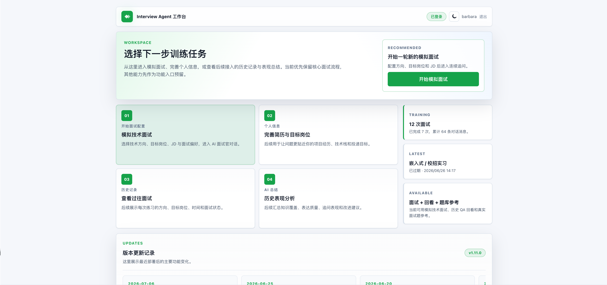
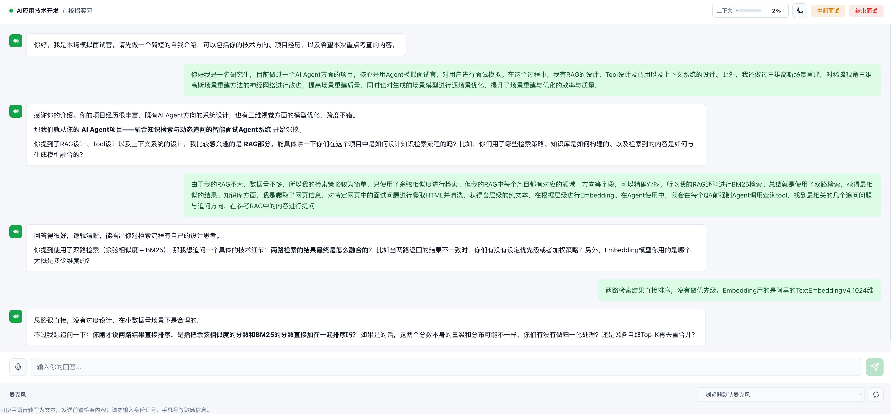
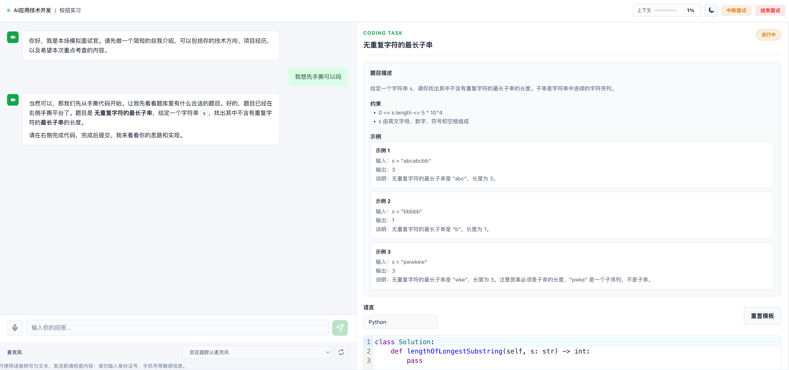
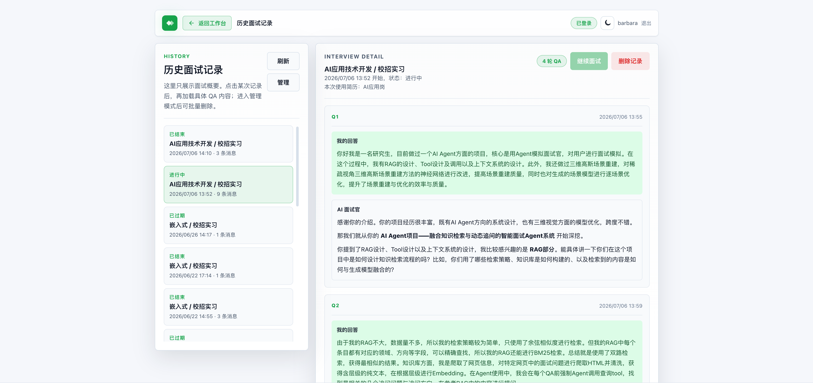

<div align="center">

# InterviewLG

**基于 LangGraph 的对话式 AI 模拟技术面试系统**

真实大厂面经驱动 · 流式对话 · 手撕代码平台 · 多阶段状态机 · 三级记忆 · MCP 工具集成

[](https://github.com/BarbaraXXX/InterviewLG/actions/workflows/ci.yml)
[](docs/git-version-history.md)
[](https://www.python.org/)
[](https://nodejs.org/)
[](LICENSE)

</div>

---

## 简介

InterviewLG 是一个面向求职者与面试官训练场景的端到端面试模拟系统。它不是简单的"刷题机器人"，而是一个由 LangGraph 驱动的对话式 Agent——会根据你的回答追问深挖、按阶段推进面试流程、在你答得浅时主动追问、在合适时机出手撕代码题，并基于真实大厂面经聚合的偏好画像让提问更贴近真实场景。

### 为什么选择 InterviewLG

- **真实对话式面试**：不是单轮问答，是多轮深度对话。Agent 会根据你的回答质量调整追问深度，回答浅了就追问，答得好就推进到下一话题。
- **面经偏好注入**：基于真实大厂面经（华为、字节等）LLM 聚合的偏好 Profile，让面试问题贴近真实场景，而不是泛泛而谈。
- **手撕代码平台**：内置 Hot100 算法题库，面试中实时出题、在线写代码、支持 Python / Java / C++ / JavaScript / TypeScript 等多语言。
- **8 大技术方向**：后端、前端、全栈、算法、嵌入式、DevOps、数据、安全，覆盖主流求职场景。
- **JD 定制面试**：贴入目标岗位 JD，LLM 自动结构化并调整面试侧重，针对性训练。
- **完整工程化**：JWT 鉴权、SSE 流式、SQLite 持久化、Docker 一键部署、Nginx 反代 + Let's Encrypt 自动续期，生产级开箱即用。

---

## 功能预览

> 以下截图展示主要功能界面。建议替换为实际运行截图或演示 GIF。

| 面试配置 | 流式对话 |
|:---:|:---:|
|  |  |

| 手撕代码平台 | 历史回放 |
|:---:|:---:|
|  |  |

**核心特性一览**：

- 🎙 **流式 SSE 输出**：token 级实时流式，对话体验丝滑
- 🧠 **三级记忆系统**：话题摘要 / 滚动摘要 / 用户级跨会话偏好
- 🎯 **多阶段状态机**：opening → project → technical → coding → summary，自动推进
- 📚 **RAG 检索增强**：基于真实面经 QuestionCard 的语义检索，按领域过滤
- 🔧 **MCP 工具集成**：支持 HTTP / stdio MCP server，工具可插拔
- 📝 **JD 智能解析**：LLM 结构化 JD，沙箱式注入系统提示词
- 🎤 **语音输入**：支持 OpenAI 兼容 / DashScope+OSS 语音转写
- 🛡 **生产级安全**：HttpOnly cookie + 邀请码 + 限流 + 严格 CSP + HSTS
- 📊 **管理后台**：在线用户、活跃会话、日活统计、7 天趋势
- 📱 **响应式设计**：移动端底部导航 + 桌面端三栏布局

---

## 架构

```
┌─────────────┐     ┌──────────────────┐     ┌──────────────────┐
│   浏览器     │────▶│  interview-agent │────▶│ interview-vectordb│
│  React SPA  │◀────│  FastAPI :8000   │◀────│  FastAPI :9000    │
│             │     │                  │     │  + MCP :9000/mcp  │
│             │     │  LangGraph Agent │     │  ProfileDB (JSON) │
│             │     │  JWT Auth        │     │  SQLite 向量检索  │
│             │     │  SQLite WAL      │     │  LLM 聚合         │
└─────────────┘     └──────────────────┘     └──────────────────┘
                            │
                            ▼ HTTP / MCP
                     外部 MCP 工具（可选）
```

**核心数据流**：

1. 前端选择领域 / 难度 / JD / 偏好 → `POST /api/sessions` 创建会话
2. Agent 调 vectordb 拉取 Profile → LLM 结构化 JD → 注入系统提示词
3. 面试全程由 LangGraph Agent 驱动：每轮组装上下文（消息 + 滚动摘要 + 状态 + 记忆 + 阶段控制 + RAG 卡片）→ SSE 流式输出
4. 每轮结束后台触发状态评估：LLM 提取话题状态 / 答案质量，更新阶段状态机，必要时生成话题摘要
5. 会话结束后台触发用户偏好记忆合并：把本会话话题摘要合并为跨会话用户偏好画像

更详细的架构与模块设计见 [docs/Trae/CodeWiki.md](docs/Trae/CodeWiki.md)。

---

## 快速开始

### 前置条件

- Python 3.12+，[uv](https://docs.astral.sh/uv/)
- Node.js 22.13+
- DeepSeek API Key（或其他 OpenAI 兼容 LLM）

### 1. 配置环境变量

```bash
# interview-vectordb/.env
cp interview-vectordb/.env.example interview-vectordb/.env
# 编辑 LLM_API_KEY 填入 DeepSeek API Key

# interview-agent/.env
cp interview-agent/.env.example interview-agent/.env
# 编辑 LLM_PROVIDERS 填入 API Key 与 provider 配置
```

### 2. 启动 vectordb（先启动）

```bash
cd interview-vectordb
uv sync
uv run interview-vectordb         # REST + MCP 服务 :9000
```

### 3. 导入面经 & 生成 Profile（可选）

```bash
# 准备面经 JSON（参考 interview-vectordb/src/interview_vectordb/schema.py 的 InterviewExperience）
uv run interview-vectordb import /path/to/experiences/
uv run interview-vectordb regen     # LLM 聚合生成 Profile
uv run interview-vectordb list      # 查看已生成 Profile
```

### 4. 构建并启动 Agent

```bash
cd interview-agent
uv sync
cd web && npm install && npm run build && cd ..   # 构建前端
uv run interview-agent-server                     # FastAPI :8000
```

### 5. 访问

浏览器打开 http://localhost:8000

### CLI 模式（无前端，快速验证）

```bash
cd interview-agent
uv run interview-agent             # 交互式 CLI 面试
```

---

## 生产部署

### 前置条件

- **服务器**：最低 1 核 2G（建议加 2G swap），推荐 2 核 4G
- **域名**：已备案，DNS 解析到服务器 IP
- **端口**：安全组放行 80（HTTP）与 443（HTTPS）
- **Docker** + Docker Compose 已安装

### 一键部署

```bash
git clone git@github.com:BarbaraXXX/InterviewLG.git
cd InterviewLG
cp interview-agent/.env.example interview-agent/.env
vim interview-agent/.env            # 填齐下方配置项
```

**必填配置项**（`deploy.sh` 会强制校验）：

| 配置项 | 说明 | 生成方式 |
|---|---|---|
| `LLM_PROVIDERS` | LLM API 配置（JSON） | 填入 DeepSeek API Key |
| `AUTH_SECRET_KEY` | JWT 签名密钥 | `python3 -c "import secrets; print(secrets.token_urlsafe(48))"` |
| `AUTH_INVITE_CODE` | 注册邀请码（逗号分隔多个） | 自定义 |
| `VECTORDB_ADMIN_TOKEN` | VectorDB 写接口管理令牌 | `python3 -c "import secrets; print(secrets.token_urlsafe(32))"` |
| `SERVER_CORS_ORIGINS` | CORS 允许的来源 | `https://你的域名` |
| `SSL_DOMAIN` | 你的域名 | `你的域名` |
| `SSL_EMAIL` | Let's Encrypt 通知邮箱 | `admin@你的域名` |
| `PYPI_INDEX_URL` | Docker 构建 Python 依赖源（国内服务器建议配置镜像） | `https://pypi.tuna.tsinghua.edu.cn/simple` |

部署：

```bash
cd interview-agent/deploy
bash deploy.sh
```

`deploy.sh` 自动完成：校验配置 → 创建目录 → `envsubst` 生成 nginx 配置 → 首次运行时申请 SSL 证书 → 构建 Docker 镜像 → 启动 app / vectordb / nginx / certbot 全部服务。

部署完成后访问 `https://你的域名`，证书由 certbot 容器每 12 小时自动续期。

### 更新部署

```bash
cd /path/to/InterviewLG
git pull origin main
cd interview-agent/deploy
bash deploy.sh
```

> ⚠️ **务必用 `bash deploy.sh`**，不要手动 `docker compose build/up`——手动操作不会执行 `envsubst` 域名替换，也更容易在小内存机器上触发 OOM。

### 服务管理

```bash
cd interview-agent/deploy

docker compose logs -f app           # 后端日志
docker compose logs -f nginx         # 反向代理日志
docker compose restart app           # 重启单个服务
docker compose down                  # 停止全部
```

### 常见问题

<details>
<summary><b>部署后无法访问 HTTPS</b></summary>

确认安全组放行了 80 和 443 端口。
</details>

<details>
<summary><b>nginx 报错 <code>cannot load certificate //fullchain.pem</code></b></summary>

`.env` 变量未被 `envsubst` 替换，用 `bash deploy.sh` 重新部署即可。
</details>

<details>
<summary><b>构建时服务器卡死或 SSH 断开</b></summary>

内存不足被 OOM killer。加 swap 后再构建：

```bash
sudo fallocate -l 2G /swapfile && sudo chmod 600 /swapfile
sudo mkswap /swapfile && sudo swapon /swapfile
echo '/swapfile none swap sw 0 0' | sudo tee -a /etc/fstab
```
</details>

<details>
<summary><b>注册报错 <code>Permission denied: /app/data/interview.db</code></b></summary>

`data/` 目录权限问题。不要用 `chmod 777`，让当前部署用户拥有数据目录：

```bash
sudo mkdir -p /path/to/InterviewLG/data
sudo chown -R "$USER:$USER" /path/to/InterviewLG/data
chmod 750 /path/to/InterviewLG/data
```
</details>

<details>
<summary><b>证书已存在但 nginx 不加载</b></summary>

可能是 archive 目录为空导致符号链接断掉，重新签发：

```bash
docker compose run --rm certbot certbot certonly --force-renewal \
    --webroot --webroot-path /var/www/certbot \
    -d 你的域名 --email 你的邮箱 --agree-tos --no-eff-email
docker compose restart nginx
```
</details>

---

## 项目结构

```
InterviewLG/
├── interview-agent/          # 面试 Agent 主服务（FastAPI + LangGraph + React）
│   ├── src/interview_agent/   # Python 后端
│   ├── web/                    # React SPA
│   ├── deploy/                 # Docker Compose + Nginx + deploy.sh
│   └── tests/
├── interview-vectordb/        # 面经偏好与检索服务（FastAPI + FastMCP）
│   ├── src/interview_vectordb/
│   └── tests/
├── interview-tester/          # 自动化评测（CLI + Web + 套件）
│   ├── src/interview_tester/
│   ├── suites/*.yaml           # 预置测试套件
│   └── web/index.html          # 单文件 SPA
├── coding-problems/           # 离线编程题生成流水线
│   └── src/coding_problem_pipeline/
├── rag-data-pipeline/         # 离线 RAG 数据采集流水线
│   ├── src/rag_data_pipeline/
│   └── config/xiaolin_sources.json
├── docs/                       # 文档
├── scripts/check.sh            # 全工程统一检查脚本
└── .github/workflows/ci.yml    # CI 流水线
```

### 各模块职责

| 模块 | 职责 |
|---|---|
| **interview-agent** | 面试主流程编排：LangGraph Agent、FastAPI HTTP/SSE、JWT 鉴权、SQLite 持久化、手撕代码平台、MCP 工具、RAG、多级记忆、状态机、JD 解析、语音转写 |
| **interview-vectordb** | 面经偏好服务：LLM 聚合 Profile、QuestionCard 语义检索、CodingProblem 结构化 + 语义检索，REST + MCP 双协议 |
| **interview-tester** | 自动化评测：5 种行为风格的模拟候选人与 Agent 对战，独立评估 LLM 输出八维评分 |
| **coding-problems** | 离线编程题生成：基于低风险索引用 LLM 原创生成 CodingProblem JSONL，人工复核后导入 vectordb |
| **rag-data-pipeline** | 离线 RAG 数据采集：抓取公开面试题页面，清洗、分块、LLM 抽取 QuestionCard |

---

## 技术栈

### 后端

| 类别 | 技术 |
|---|---|
| 语言 | Python 3.12 |
| 包管理 | [uv](https://docs.astral.sh/uv/) |
| Web 框架 | FastAPI + uvicorn |
| Agent 框架 | LangGraph + LangChain |
| LLM | DeepSeek / OpenAI 兼容 API |
| MCP | mcp + langchain-mcp-adapters |
| 数据库 | SQLite（aiosqlite，WAL 模式） |
| 鉴权 | JWT（PyJWT）+ bcrypt |
| 限流 | slowapi |
| 向量检索 | SQLite + 自实现余弦相似度 |
| 语音 | OpenAI 兼容 / DashScope + 阿里云 OSS |
| Token 计数 | tiktoken |

### 前端

| 类别 | 技术 |
|---|---|
| 框架 | React 19 + TypeScript 6 |
| 构建 | Vite 8 |
| 路由 | react-router-dom 7 |
| 代码编辑器 | CodeMirror 6 |
| Markdown | react-markdown + KaTeX |
| 图标 | lucide-react |
| 测试 | node:test |

### 部署

| 类别 | 技术 |
|---|---|
| 容器 | Docker + Docker Compose |
| 反向代理 | Nginx（含限流 + 安全头） |
| 证书 | Let's Encrypt + certbot |
| CI | GitHub Actions |

---

## 文档

- [Code Wiki](docs/Trae/CodeWiki.md) — 完整的代码结构与模块设计文档
- [开发规范](docs/code-style.md) — 代码风格与约定
- [发布清单](docs/release-checklist.md) — 发布前检查清单
- [版本历史](docs/git-version-history.md) — 版本变更记录
- [贡献指南](CONTRIBUTING.md) — 参与贡献方式

---

## 开发

### 本地检查

```bash
# 单包检查（在对应目录下）
cd interview-agent && uv run ruff check src tests && uv run pytest
cd interview-vectordb && uv run ruff check src tests && uv run pytest
cd interview-tester && uv run ruff check src tests && uv run pytest

# 前端
cd interview-agent/web && npm run lint && npm run build

# 全工程一键检查
bash scripts/check.sh
CHECK_FORMAT=1 bash scripts/check.sh             # 含格式检查
ISOLATED_UV_CACHE=1 bash scripts/check.sh        # 隔离 uv 缓存
```

### 离线数据生产

```bash
# 编程题生成
cd coding-problems
python3 run.py generate --input data/input/hot100_index.jsonl
python3 run.py validate --input data/generated/hot100_generated.jsonl
# 人工复核后
python3 run.py promote --input data/generated/hot100_generated.jsonl

# RAG 卡片抽取
cd rag-data-pipeline
python3 run.py all                # fetch + build + split
# 可选：python3 run.py enrich    # 二次 LLM 归一化

# 导入 vectordb
cd interview-vectordb
uv run interview-vectordb import-coding-problems ../coding-problems/data/reviewed
uv run interview-vectordb import-cards ../rag-data-pipeline/data/output/question_cards
```

### 自动化评测

```bash
cd interview-tester
uv sync
uv run interview-tester --domain backend --difficulty mid --candidate-level mid
uv run interview-tester --suite suites/quick_coverage.yaml    # 跑预置套件
uv run interview-tester-server                                 # Web UI :8765
```

详见 [贡献指南](CONTRIBUTING.md)。

---

## 路线图

- [x] LangGraph Agent + SSE 流式对话
- [x] JWT 鉴权 + 邀请码
- [x] 多阶段状态机 + 三级记忆
- [x] 手撕代码平台 + Hot100 题库
- [x] RAG 检索 + 面经偏好聚合
- [x] MCP 工具集成
- [x] 语音输入
- [x] 管理后台监控
- [x] 移动端响应式
- [x] Docker 一键部署 + 自动 HTTPS
- [ ] 多 worker 部署支持
- [ ] 用户级 LLM 配额
- [ ] 自动数据备份
- [ ] 更多领域面经接入
- [ ] 国际化（i18n）

---

## 贡献

欢迎 Issue 和 PR！参与方式见 [CONTRIBUTING.md](CONTRIBUTING.md)。

开发在 `develop` 分支进行，发布合并到 `main`。提 PR 前请运行 `bash scripts/check.sh` 确保通过检查。

### 评审重点

- 用户数据泄漏与会话 / 账号安全
- 公站劫持或不安全的反向代理行为
- 小规格服务器（2 核 2G / 4G）资源占用
- 面试状态 / 记忆 / RAG / 手撕代码流程完整性
- 前端构建与 TypeScript 回归

---

## License

[MIT License](LICENSE) - Copyright (c) 2026 BarbaraXXX

---

<div align="center">

如果这个项目对你有帮助，欢迎 ⭐ Star 支持！

</div>
